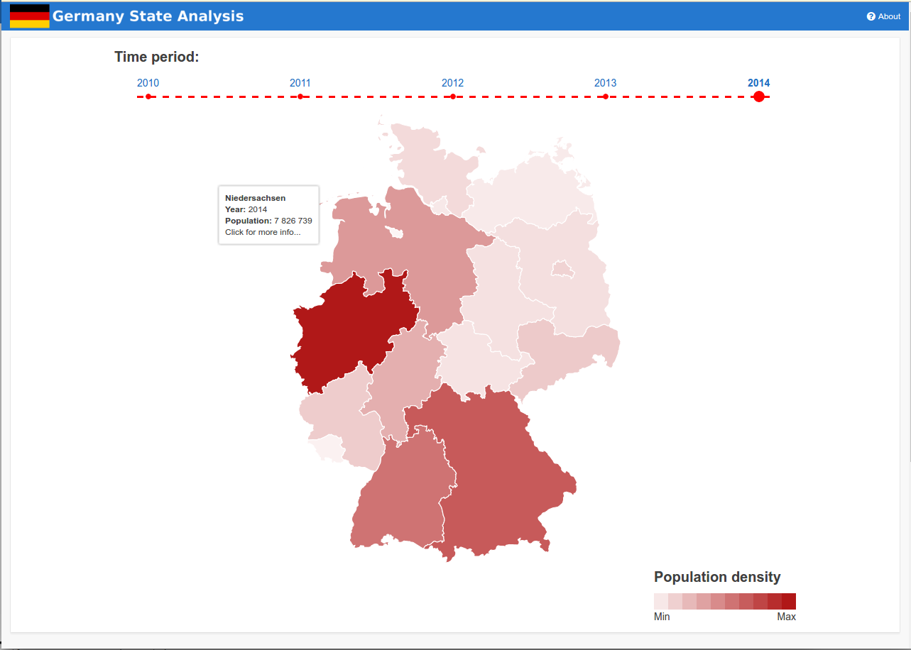
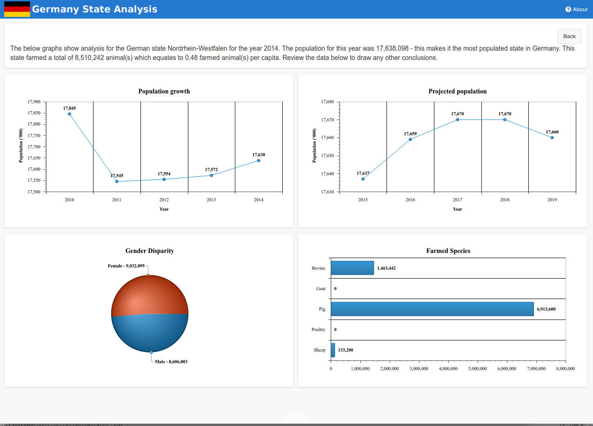

# 2016 APEX Dashboard Competition

Entry by Trent Schafer

Demo: https://apex.oracle.com/pls/apex/f?p=94455

## Installation

This application assumes the availability of the data for this competition is already installed in the parsing schema.

To install, simply import the application in the root of this project, `f103.sql`.

## Running

The main page for this application is page 1, which you should be taken to upon running the application.

Initially, you will be presented with the German map coloured to indicate the number of people living in that state in relation to the most populated state.



You can click on a state to get a deeper analysis of that particular state.



## High level application design

The map is encapsulated into a plugin named `Map of Germany`, which includes the components:

* timeline
* map
* population density legend

On page load, some collections are created in before header processes.

1. FED_STATE_MAP - Creating an assignment of a state name to a code value. Specifically, adm1_code which is unique for each state and extracted from the shape file from the naturalearthdata.com data feed.
* GERMANY_POPULATION_HISTORY - To avoid re-typing the same query, loading the population data into a collection.
* SPECIES_SIMPLIFIED - I felt the number of different species that are farmed is too large to display in a single chart, so have simplified the potential species, reducing it to 5 species.
* FARMING_SUMMARY - To avoid re-typing the same query, loading the farming data into a collection.

On the map page, there is a time line so you can refocus the data to the clicked on year. After changing the year and viewing the graphs, the population history will only show up to that year. After going back to an earlier year, the projected population will still begin from the same period - as I figured the user would still want the projection graph still only to be from projected data and not historical data.

When displaying the charts, I wanted to include a summary statement about the state/year/information being displayed. I've put this into an AJAX callback (application process) named `GET_SUMMARY`. I went this route instead of a `Set Value` action due to the size limitation of the `Set Value` PL/SQL text area.

### Plugins

#### Map of Germany

This is a region plugin to display the timeline, map and population density (legend). It uses d3js and topoJSON technologies for the actual map rendering.

Events:

* German State Clicked - when you click a state, this event will fire. Sends the `ADM1_CODE` in the event data
* Timeline time period clicked - when you click a year on the time line above the map, this event will fire. Sends the year clicked in the event data.

Settings:

* Map colour - Allows you to set the dominant colour for the most populated state in Germany (which less populated becoming more transparent versions of that colour).
* Container width - The width of the containing element of all the map components (timeline, map and population density).
* Timeline years - how many years to display on the timeline at the top of the page (up to the current maximum recorded history in the database)

#### Slid up/Slide down

This is a dynamic action plugin, used as a hide and show style function. This is designed specifically to hide one region (slide up) and showing another (slide down) - in the case of this application, hide the map and show the charts; and then vice-versa.

Settings:

* jQuery selector to slide up
* jQuery selector to slide down
* Slide duration (for each operation, not the total duration for both operations combined) - defaults to 800

## Third party resources

### Logo

The application logo uses a German Map (src/img/DE.png) which was sourced from https://github.com/googlei18n/region-flags. According the the `COPYING` documentation, these were grabbed from Wikipedia and checked to be in the public domain or exempt from copyright.

### Map Visualisation

The visualisation for the map was created by using:

* D3JS - https://github.com/mbostock/d3; and
* TopoJSON - https://github.com/mbostock/topojson

Applicable license agreement for these two libraries:

>Copyright (c) 2012-2016, Michael Bostock
>All rights reserved.
>
>Redistribution and use in source and binary forms, with or without
>modification, are permitted provided that the following conditions are met:
>
>* Redistributions of source code must retain the above copyright notice, this
>  list of conditions and the following disclaimer.
>
>* Redistributions in binary form must reproduce the above copyright notice,
>  this list of conditions and the following disclaimer in the documentation
>  and/or other materials provided with the distribution.
>
>* The name Michael Bostock may not be used to endorse or promote products
>  derived from this software without specific prior written permission.
>
>THIS SOFTWARE IS PROVIDED BY THE COPYRIGHT HOLDERS AND CONTRIBUTORS "AS IS"
>AND ANY EXPRESS OR IMPLIED WARRANTIES, INCLUDING, BUT NOT LIMITED TO, THE
>IMPLIED WARRANTIES OF MERCHANTABILITY AND FITNESS FOR A PARTICULAR PURPOSE ARE
>DISCLAIMED. IN NO EVENT SHALL MICHAEL BOSTOCK BE LIABLE FOR ANY DIRECT,
>INDIRECT, INCIDENTAL, SPECIAL, EXEMPLARY, OR CONSEQUENTIAL DAMAGES (INCLUDING,
>BUT NOT LIMITED TO, PROCUREMENT OF SUBSTITUTE GOODS OR SERVICES; LOSS OF USE,
>DATA, OR PROFITS; OR BUSINESS INTERRUPTION) HOWEVER CAUSED AND ON ANY THEORY
>OF LIABILITY, WHETHER IN CONTRACT, STRICT LIABILITY, OR TORT (INCLUDING
>NEGLIGENCE OR OTHERWISE) ARISING IN ANY WAY OUT OF THE USE OF THIS SOFTWARE,
>EVEN IF ADVISED OF THE POSSIBILITY OF SUCH DAMAGE.

The underlying data used to render the German map was sourced from http://www.naturalearthdata.com/. Specifically, the `10m Admin 1 - States, Provinces` data collection. The data is stated as being in the public domain: http://www.naturalearthdata.com/about/terms-of-use/

The data is a shape file, which needs to be converted into a format that d3 and more specifically topoJSON can understand. The is a two part process. Using the command `ogr2ogr` to get the file in a GeoJSON format.

```bash
ogr2ogr -f GeoJSON -where "ADM0_A3 = 'DEU'" states.json ne_10m_admin_1_states_provinces.shp
```

This outputs a GeoJSON file named `states.json`. The next step is to convert this into a topoJSON file. In this command we can limit the data to include only data fields we care about, namely the `id` property being the adm1_code and the name of the state (which is a small subset of what's available in the shape file).

```bash
topojson -o de.json --id-property adm1_code --properties name=name -- states.json
```

This produces the final data file we will use containing all necessary data points to draw the German map with the topojson library.
